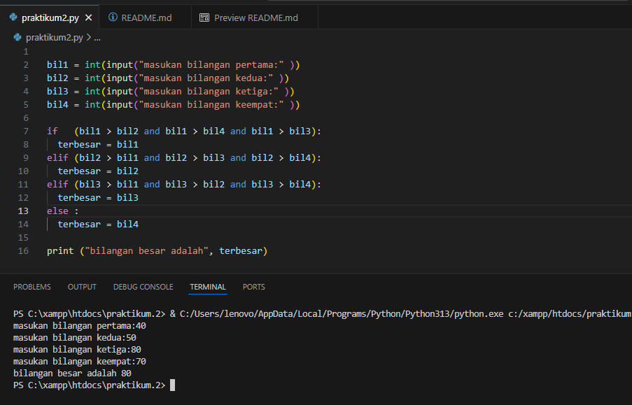

# Penjelasan Program
## Praktikum Latihan 1 <a href="Praktikum Latihan1">File Latihan1</a>
Menentukan bilangan terbesar dari empat bilangan yang di masukan 

## Alur Program
### 1. Input data dari empat bilangan yang di masukan
   <pre>bil1 = int(input("masukan bilangan pertama:" ))
   bil2 = int(input("masukan bilangan kedua:" ))
   bil3 = int(input("masukan bilangan ketiga:" ))
   bil4 = int(input("masukan bilangan keempat:" ))</pre>
### 2. Proses perbandingan
   <ul><li>Menggunakan Struktur <strong>if-elif-else</strong> untuk membandinkan keempat bilangan tersebut dan menentukan mana yg paling besar <li>Perbandingan :
   
   <pre>if (bil1 > bil2 and bil1 > bil4 and bil1 > bil3):
   terbesar = bil1
   elif (bil2 > bil1 and bil2 > bil3 and bil2 > bil4):
   terbesar = bil2
   elif (bil3 > bil1 and bil3 > bil2 and bil3 > bil4):
   terbesar = bil3
   else :
   terbesar = bil4</ul></pre>
### 4. Output Hasil
  <ul><li>Setelah menentukan bilangan terbesar, maka pada akhir akhir akan menampilkan hasilnya.
  
<b> print ("bilangan besar adalah", terbesar)

### Contohnya pada bagian bawah ini :
1. 

  