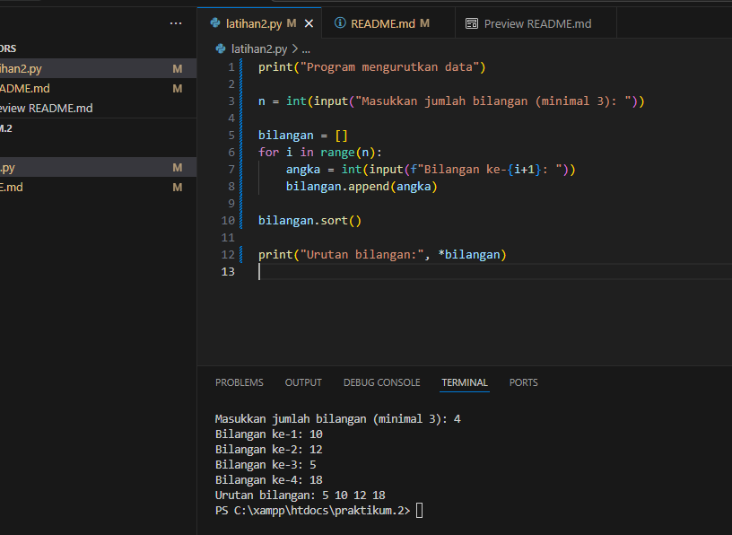

# Latihan 2 
## Mengurutkan Data <a href="">Latihan2</a>
Membuat program Python untuk <b>mengurutkan beberapa data angka</b> berdasarkan nilai input (menimal tiga angka) secara berurutan <b>dari nilai kecil.</b>

## cara membuat file program 
<pre><ul><li>Buka Visual Studio Code (VSC) di laptop
<li>buka open folder dan buat folder baru di file explorer dan mau masukin foldernya di bagian file mana.
<li>masukan filenya ke visual studio code.
<li>masukan folder di VSC "Contoh, latihan2.pY</pre>

## Menginput Program
<pre><li>masukan kode programnya dan jalankan programnya.
<li>tetukan hasil programnya di bagian terminal.
<li><b>contoh pada gambar di bawah ini.</pre>

## Penjelasan Bagian Program
<pre><li>| Bagian Kode | Fungsi                                           |
| ----------- | ------------------------------------------------ |
| `input()`   | Menerima data dari pengguna                      |
| `int()`     | Mengubah input menjadi angka (integer)           |
| `list`      | Menyimpan beberapa data angka                    |
| `sort()`    | Mengurutkan data dari nilai terkecil ke terbesar |
| `*data`     | Menampilkan semua isi list tanpa tanda kurung    |

